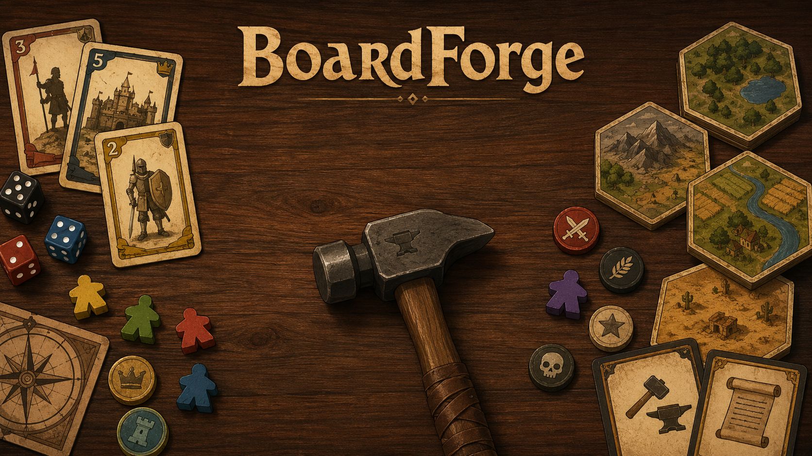
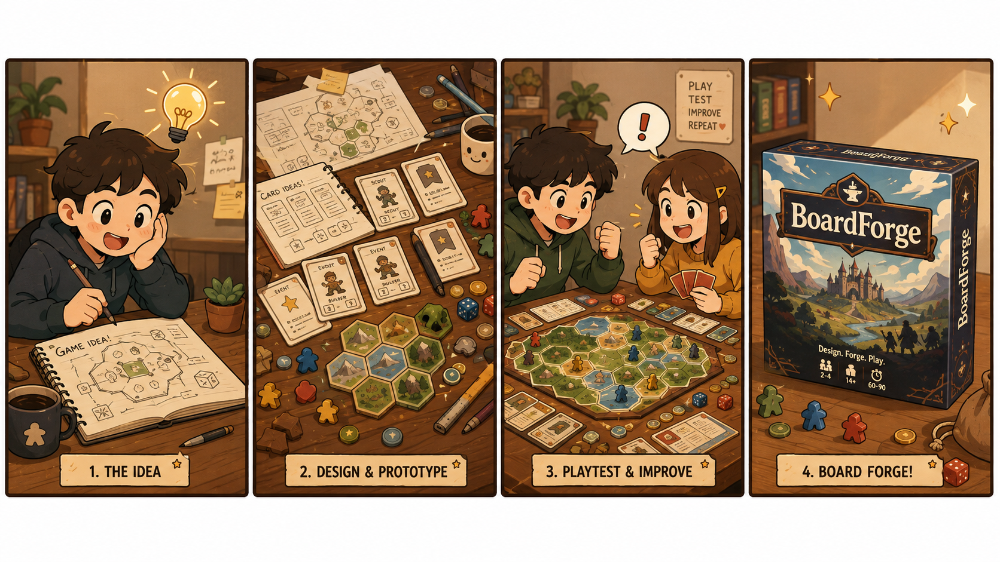
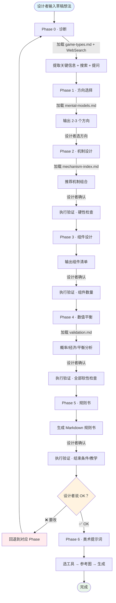

<div align="center">



# Board Game Designer · 桌游设计师

> *「游戏机制相当于手表内部的机械零件。所谓优秀的游戏机制，只有置于特定的游戏之中才具有意义。」*

[](LICENSE)
[](https://agentskills.io)

<br>

**从草稿想法到可落地的完整桌游设计助手。**

覆盖所有桌游类型，支持所有设计阶段，全程主动提问确保不偏离设计者意图。

[效果示例](#效果示例) · [安装](#安装) · [架构](#架构) · [工作流程](#工作流程)

</div>

---

<div align="center">

</div>

## 效果示例

> 💡 完整实战案例见 [examples/dunhuang-9-card-game/](examples/dunhuang-9-card-game/)——从"做一个敦煌9卡游戏"的想法到可测试原型的全过程。

```
设计者    ❯ 我想做一个敦煌主题的9卡游戏

Board Game Designer ❯ 好的，敦煌主题很有潜力。在深入之前，我想了解几个关键点：
             1. 目标玩家是谁？朋友聚会？亲子？还是有一定桌游经验的玩家？
             2. 你希望玩家玩完后记住什么感觉？紧张刺激的竞速？还是轻松愉快的收集？
             3. 9张卡是每张都不同，还是有重复？

设计者    ❯ 朋友聚会用的，轻松一点，每张都不同

Board Game Designer ❯ 明白了。基于"聚会+轻松+9张不同卡"的约束，我给你3个方向：

             方向A: 文化探索+成套收集
             核心体验：玩家收集敦煌壁画碎片，凑齐一幅完整壁画
             参考经典：璀璨宝石（简化版）
             优势：规则极简，视觉效果好  风险：互动性偏弱

             方向B: 叙事冒险+手牌管理
             核心体验：沿丝绸之路冒险，每张卡是一个岔路口
             参考经典：瘟疫危机（极简版）
             优势：有故事感  风险：重玩性受限

             方向C: 拍卖竞标+历史事件
             核心体验：争夺敦煌宝藏，每轮拍卖一件文物
             参考经典：电力公司（极简版）
             优势：互动性强  风险：需要心理博弈能力

             你更倾向哪个方向？
```

---

## 安装

### 方式一：一行命令（推荐）

打开你正在用的 agent（Claude Code、Codex、Cursor 等），告诉它：

```
帮我安装这个 skill：https://github.com/HAJIGAN-doro/board-game-designer
```

或用通用 CLI 安装器：

```bash
npx skills add HAJIGAN-doro/board-game-designer
```

### 方式二：手动安装

| Runtime | 安装路径 |
|---------|---------|
| Claude Code | `~/.claude/skills/board-game-designer/` |
| Codex CLI | `~/.codex/skills/board-game-designer/` |
| Cursor | `~/.cursor/skills/board-game-designer/` |

```bash
git clone https://github.com/HAJIGAN-doro/board-game-designer <上面对应的路径>
```

### 使用

装好后，告诉 agent：

```
> 帮我做一个敦煌主题的9卡桌游
> 我想设计一个适合家庭聚会的桌游
> 帮我看看这个桌游设计有没有问题
> 用工人放置机制设计一个2人对战游戏
```

---

## 架构

### 分层设计

```
SKILL.md (230行)                    ← AI 每次都读，很轻
├── 触发词 + 角色定位
├── 问题路由表                       ← 核心！告诉AI"遇到什么问题去读什么文件"
├── Phase 0-6 精简工作流
├── 行为规则（精简版）
├── 反模式黑名单
└── Reference 索引

references/                          ← 按需加载，不是每次都读
├── mental-models.md    (118行)      ← 设计方向/思维框架
├── game-types.md       (148行)      ← 桌游分类体系（德式/美式/毛线/兵棋/…）
├── mechanism-index.md  (130行)      ← ~200种机制速查索引
├── classic-games.md    (177行)      ← 17款经典桌游设计要点
└── validation.md       (71行)       ← 设计验证清单（15条检查规则）
```

### 问题路由（核心机制）

AI 收到问题后，**先判断类型，再加载对应文件**，不会一次读完所有知识：

| 用户问题类型 | 加载哪个文件 | 执行什么 |
|------------|-------------|---------|
| 完整设计流程（从想法到成品） | 按各 Phase 指示加载 | 走 Phase 0→6 |
| "XX类型的游戏有什么特点" | → `game-types.md` | 直接回答 |
| "XX机制怎么运作" | → `mechanism-index.md` | 直接回答 |
| "参考XX游戏的设计" | → `classic-games.md` | 直接回答 |
| "怎么让游戏更好玩" | → `mental-models.md` | 直接回答 |
| "帮我验证这个设计" | → `validation.md` | 执行验证 |

**好处**：弱模型也不会"看了后面忘前面"，每次只加载需要的知识。

### 设计验证机制

每个 Phase 完成后自动执行验证，**在设计者发现之前就指出问题**：

| 检查类型 | 示例 |
|---------|------|
| 硬性检查 | 组件数量够不够？牌堆会不会中途耗尽？有没有死循环？ |
| 软性检查 | 先手优势过大吗？有明显最优策略吗？时长匹配定位吗？ |
| 微桌游专项 | 每张卡有多重用途吗？效果复杂度梯度合理吗？ |

---

## 工作流程



**全程行为规则**：
- 💬 每个阶段主动提问，不等检查点
- 🔍 设计者提到任何游戏/机制/主题，自动搜索
- 📚 知识按需加载，不一次全读
- ⬅️ 任何阶段可回退，只重做被要求修改的部分
- ✅ 每个 Phase 完成后自动验证，提前发现设计问题

---

## 知识体系

| 内容 | 文件 | 行数 |
|------|------|------|
| 5个心智模型 + 10条决策启发式 | `mental-models.md` | 118行 |
| 桌游分类体系（7大类型+详细定义） | `game-types.md` | 148行 |
| ~200种机制速查索引 | `mechanism-index.md` | 130行 |
| 17款经典桌游设计要点 | `classic-games.md` | 177行 |
| 设计验证清单（15条检查规则） | `validation.md` | 71行 |

---

## 实战案例

| 案例 | 描述 | 文件 |
|------|------|------|
| [敦煌·九色鹿](examples/dunhuang-9-card-game/) | 从"做一个敦煌9卡游戏"到完整规则书+美术提示词 | `demo.md` + `rules.md` |

---

## 适合谁

| 你是谁 | Board Game Designer 能帮你什么 |
|--------|---------------------|
| 零基础有想法 | 从"我想做个XX游戏"开始，全程引导到可落地的规则书 |
| 有桌游经验想设计 | 快速获得机制组合建议、数值平衡参考、经典设计对标 |
| 已有设计想优化 | 诊断模式分析现有设计，找出问题和改进方向 |
| 需要美术素材 | 规则确认后一键生成 AI 美术提示词 |

---

## 许可证

[CC BY-NC-SA 4.0](LICENSE) — 允许学习、分享、改进，**禁止商用**。

商用请联系作者获取授权。
